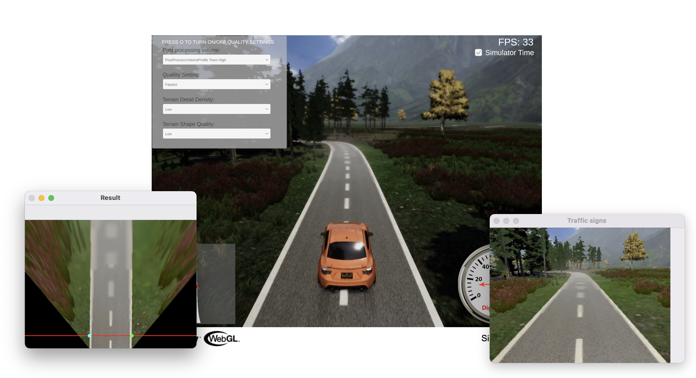

# Cuộc đua số 2023 - Thử thách: Thuật toán Tự hành

Trong thử thách này, các đội chơi sẽ phải lập trình thuật toán điều khiển xe tự hành bám làn và đi theo các biển báo giao thông có sẵn, gồm 5 biển: Rẽ trái (Turn left), Rẽ phải (Turn right), Đi thẳng (Straight), Dừng (Stop) và Cấm (No entry).

Các đội chơi thực hiện phát triển, tối ưu các thuật toán AI để điều khiển xe tự lái trong môi trường giả lập. Trong buổi thi đấu chính thức, mỗi đội sẽ có thời gian 1h để tối ưu thuật toán theo đề bài nhận được từ ban tổ chức.

- Mỗi đội có tối đa 3 lần gửi kết quả tới ban tổ chức để hệ thống tính điểm trong 1h thi đấu.
- Sau mỗi lần đội chơi nộp bài, thuật toán sẽ được sử dụng để điều khiển xe trên giả lập và trả về kết quả. Ban tổ chức sẽ có hệ thống tự động ranking kết quả của các đội
- **8 đội có kết quả mô phỏng tốt nhất sẽ bước tiếp vào vòng phỏng vấn.**

## 1. Thử nghiệm thuật toán với giả lập

### 1.1: Giả lập

Có 2 cách sử dụng giả lập:

- Truy cập giả lập dành cho thử nghiệm tại: [https://daisylab.net/via-sim-2023-07-24/](https://daisylab.net/via-sim-2023-07-24/).
- Truy cập và cài đặt giả lập trên máy tính cá nhân:
  - Windows: [Tải về](https://github.com/makerviet/tfs-auto-algorithms/releases/download/v0.1/VIA-Sim-Windows-2023-07-24.zip);

### 1.2: Mã nguồn điều khiển xe mẫu:

Cài đặt và chạy code điều khiển mẫu với Python 3.9. Khuyến khích tạo và quản lý môi trường với **Anaconda** hoặc **Miniconda**.

```bash
cd auto_control
pip install -r requirements.txt
python drive.py
```

Mã nguồn điều khiển sẽ nhận hình ảnh từ giả lập và trả về tín hiệu điều khiển cho xe.



## 2. Tài liệu đào tạo

### 2.1. Làm quen với sổ tay Colab

**Google Colab** là dịch vụ Jupyter Notebook trực tuyến của Google, rất phù hợp để học tập về xử lý ảnh và AI. Trong sổ tay Colab, các bạn có thể vừa ghi chép, vừa chạy thử các đoạn code mẫu.

Truy cập: [https://colab.research.google.com/github/makerviet/tfs-auto-algorithms/blob/master/notebooks/01-So-tay-Colab.ipynb](https://colab.research.google.com/github/makerviet/tfs-auto-algorithms/blob/master/notebooks/01-So-tay-Colab.ipynb).

### 2.2. OpenCV cơ bản

Bài học này cung cấp các kiến thức cơ bản nhất về xử lý ảnh, cách sử dụng thư viện OpenCV - một thư viện phổ biến trong xử lý ảnh - để đọc, hiển thị và chuyển đổi ảnh giữa các hệ màu khác nhau.

Truy cập: [https://colab.research.google.com/github/makerviet/tfs-auto-algorithms/blob/master/notebooks/02-OpenCV-co-ban.ipynb](https://colab.research.google.com/github/makerviet/tfs-auto-algorithms/blob/master/notebooks/02-OpenCV-co-ban.ipynb).

### 2.3. Lọc ảnh

Lọc ảnh (làm mịn ảnh, làm mượt ảnh) là một bước rất quan trọng trong xử lý ảnh. Lọc ảnh thực tế có rất nhiều tác dụng như loại bỏ nhiễu, tìm biên đối tượng.

Truy cập: [https://colab.research.google.com/github/makerviet/tfs-auto-algorithms/blob/master/notebooks/03-Loc-anh.ipynb](https://colab.research.google.com/github/makerviet/tfs-auto-algorithms/blob/master/notebooks/03-Loc-anh.ipynb).

### 2.4. Phát hiện vạch kẻ đường

Ở các bài trước, chúng ta đã được làm quen với các thuật toán xử lý ảnh cơ bản. Các thuật toán này hoàn toàn có thể được áp dụng để phát hiện làn đường trong ảnh hết sức dễ dàng. Ở phần này, chúng ta sẽ cùng xây dựng thuật toán phát hiện vạch kẻ đường từ đầu bằng các kĩ thuật xử lý ảnh như chuyển đổi hệ màu, lọc nhiễu, phát hiện cạnh.

Truy cập: [https://colab.research.google.com/github/makerhanoi/via-course-ai/blob/master/notebooks/04-Phat-hien-vach-ke-duong.ipynb](https://colab.research.google.com/github/makerhanoi/via-course-ai/blob/master/notebooks/04-Phat-hien-vach-ke-duong.ipynb).

### 2.5. Phát hiện biển báo giao thông

Ngoài việc đi đúng phần đường, làn đường của mình, các xe tự lái còn phải tuân thủ các hiệu lệnh giao thông như biển báo, đèn tín hiệu. Ở phần này, chúng ta sẽ ứng dụng các kĩ thuật xử lý ảnh và trí tuệ nhân tạo để phát hiện và phân loại các biển báo có trên đường và điều khiển xe theo chỉ dẫn của các biển báo đó. 

- Truy cập: [https://colab.research.google.com/github/makerviet/tfs-auto-algorithms/blob/master/notebooks/05-Phat-hien-bien-bao.ipynb](https://colab.research.google.com/github/makerviet/tfs-auto-algorithms/blob/master/notebooks/05-Phat-hien-bien-bao.ipynb).
- Mở rộng: Huấn luyện phân loại biển báo: [https://colab.research.google.com/github/makerviet/tfs-auto-algorithms/blob/master/notebooks/06-Huan-luyen-phan-loai-bien-bao.ipynb](https://colab.research.google.com/github/makerviet/tfs-auto-algorithms/blob/master/notebooks/06-Huan-luyen-phan-loai-bien-bao.ipynb).

## 3. Đăng ký và nộp bài trên hệ thống

Thông tin này sẽ được cập nhật trong thời gian tới.
